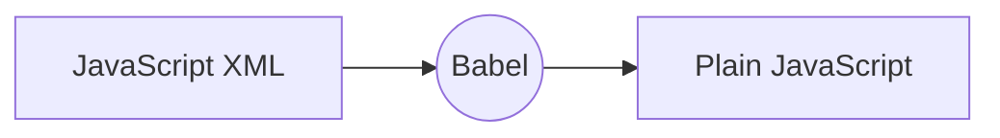

# React - Reacts to state changes

1. [Next Gen JavaScript](#1-next-gen-javascript)
    - [1.1. let and const](#11-let-and-const)
    - [1.2. ES6 Arrow functions](#12-es6-arrow-functions)
    - [1.3. Exports and Imports](#13-exports-and-imports)
    - [1.4. Classes, Properties, and Methods](#14-classes-properties-and-methods)
    - [1.5. Spread and Rest Operators](#15-spread-and-rest-operators)
    - [1.6. Destructuring](#16-destructuring)
    - [1.7. Reference and primitive type](#17-reference-and-primitive-type)
2. [Introduction](#2-introduction)
    - [2.1. Understanding base features and syntax](#21-understanding-base-features-and-syntax)
    - [2.2. Setup](#22-setup)
    - [2.3. Component](#23-component)
    - [2.4. First React App](#24-first-react-app)
    - [2.5. Props (Passing Data to component)](#25-props-passing-data-to-component)
    - [2.6. State in react](#26-state-in-react)
    - [2.7. Fetch data from API](#27-fetch-data-from-api)
    - [2.8. useEffect: builtin hook](#28-useeffect-builtin-hook)
    - [2.9. Stateless vs Stateful component](#29-stateless-vs-stateful-component)
3. [React Router](#3-react-router)
4. [State Management](#4-state-management)
    - [4.1. The need for State Management](#41-the-need-for-state-management)
    - [4.2. Setup for Context](#42-setup-for-context)
    - [4.3. Usage of context](#43-usage-of-context)
    - [4.4. Update value in the context](#44-update-value-in-the-context)
    - [4.5. Pros and Cons](#45-pros-and-cons)
5. [Redux - State management tool](#5-redux---state-management-tool)
    - [5.1. Theory](#51-theory)
    - [5.2. How to Proceed with redux library](#52-how-to-proceed-with-redux-library)
    - [5.3. How to Proceed with react-redux library](#53-how-to-proceed-with-react-redux-library)
    - [5.4. How to access value from the store (Globalized state)](#54-how-to-access-value-from-the-storeglobalized-state)
6. [From the scratch](#6-from-the-scratch)
    - [6.1. Another way of using react](#61-another-way-of-using-react)
    - [6.2. JSX](#62-jsx)
    - [6.3. Small Quirks in JSX](#63-small-quirks-in-jsx)
    - [6.4. React Setup from scratch](#64-react-setup-from-scratch)
7. [Resource](#7-resource)

## 1. Next-Gen JavaScript

### 1.1. `let and const`

### 1.2. ES6 Arrow functions

-   no more issues with **this** keyword

### 1.3. Exports and Imports

-   Default exports

```js
// person.js
const person = {
	name: 'Saurabh',
};
export default person;
```

-   Named exports

```js
// utility.js
export const clean = () => { ... }
export const baseData = 10;
```

-   Imports

```js
// app.js
import person from './person.js';
import prs from './person.js';

import { baseData } from './utility.js';
import * as bundled from './utility.js';
import { clean as reset } from './utility.js';
```

### 1.4. Classes, Properties, and Methods

```js
class Human {
	gender = 'female';
	printGender = () => {
		console.log(this.gender);
	};
}

class Person extends Human {
	name = 'Saurabh';
	gender = 'male';
	printName = () => {
		console.log(this.name);
	};
}

const person = new Person();
persion.printName(person);
persion.printGender();
```

### 1.5. Spread and Rest Operators

1. Spread

-   `...` (three dots.)
-   use to split up array elements OR object properties

    ```js
    const newArray = [...oldArray, 1, 2];
    const newObject = [...oldObject, (newProp: 6)];
    ```

-   NOTE: if oldObject also have `newProp` property, it'll get overridden in newObject.

2. Rest

-   `...` (three dots.) same as above
-   use to merge a list of function arguments into an array

    ```js
    sortArgs = (...args) => {
    	return args.sort();
    };
    ```

### 1.6. Destructuring

-   Easily extract array elements or objects properties and store then in variables.
-   Array Destructuring
    ```js
    const names = ['Saurus', 'Zed', 'Ztrimus'];
    [a, , c] = names;
    console.log(a); // Saurus
    console.log(c); // Ztrimus
    ```
-   Object Destructuring
    ```js
    {name} = {name:'Saurus', age: 23};
    console.log(name); // Saurus
    console.log(age); // undefined
    ```

### 1.7. Reference and primitive type

-   **Not next-gen features but important one.**

1. Primitive type

    - **Numbers, Strings, and Booleans** are primitive type.
    - means, on assign 1stVariable to 2ndVariable, 1stVariable's value get copy in to 2ndVariable, **NOT reference**.
        ```jsx
        let num1 = 1;
        let num2 = num1;
        console.log(num1, num2); // {num1: 1, num2: 1}
        num1 = 5;
        console.log(num1, num2); // {num1: 5, num2: 1}
        ```

2. Reference type
    - **Object and Arrays** are reference type.
    - means, on assign 1stObject to 2ndObject, javascript just copied pointer of 1stObject to 2ndObject and points to the exact same object in memory as 1stObject does.
    - Same thing happen with arrays.
        ```js
        const person = { name: 'Saurus' };
        const secondPerson = person;
        person.name = 'Ztrimus';
        console.log(secondPerson); // {name: 'Ztrimus'}
        ```
    - To avoid this behavior and copy into 2ndObject
        ```js
        const person = { name: 'Saurus' };
        const secondPerson = { ...person };
        person.name = 'Ztrimus';
        console.log(secondPerson); // {name: 'Saurus'}
        ```

## 2. Introduction

-   A javascript library for building user interfaces
-   By Facebook 2011
-   It's Library
-   Angular is Framework
-   React Do Only
    -   it takes care of rendering view and
    -   making sure that the view is in sync with the state.
-   because of this react has very few API. When building application, we need to other libraries for:
    -   Routing
    -   calling HTTP services, etc.

### 2.1. Understanding base features and syntax

-   We need a more elaborate workflow for real projects, like:

    2.  Dependency management (npm or yarn)
    3.  Bundler (Webpack)
    4.  Compiler (Babel + preset)
    5.  Development server

-   we can use `create-react-app` plugin for creating project with workflow mentained above.

```cmd
>>> create-react-app react-complete-guide --scripts-version 2.1.5
```

### 2.2. Setup

-   install nodeJs.
-   then install create-react-app `npm i -g create-react-app`
-   Id using VS Code, install `Simple React Snippets` extension.

### 2.3. Component

-   Component basically contain `state` and `render()` method.
-   Each component is the function that contains JS and JSX(like HTML).
-   **state**: Data we want to display when component render
-   **render**: responsible for describing what UI should look like
-   **react element**
    -   output of render method
    -   simple plain javascript object that maps to DOM element
    -   it's just a plain javascript object that represents that DOM element in memory
-   **Virtual DOM**:
    -   React keeps a lightweight representation of the DOM in memory which we referred to **Virtual DOM**.
    -   it's cheap to create.
    -   we don't need to work with DOM API in browsers.
    -   we don't have to change and manipulate DOM directly. (e.g. we don't need `document`, `query`, `$`, `queryselector`, `EventListener`)
    -   when components get updates, Instead of changing the whole DOM, react changes only part of DOM which responsible for a component.

```jsx
class Tweet {
	state = {};
	render() {
		// output the react element
	}
}
```

### 2.4. First React App

-   create app
    ```sh
    create-react-app first-react-app
    ```
-   run application
    ```sh
    npm start
    ```
-   It going to install react and third parties libraries like:
    -   Development server: lightweight
    -   Webpack: for bundling our files
    -   Babel: Modern Javascript Compiler for compiling javascript code ([babel repl](https://babeljs.io/repl)).
    -   other tools
-   this will create an application with a zero-configuration setup
-   for customized configuration setup use `npm run eject`.
-   open up the `App.js` file

```jsx
render() {
    return (
    // Start JavaScript XML
    <div className="App">
        <header className="App-header">
        
        <p>
            Edit <code>src/App.js</code> and save to reload.
        </p>
        <a
            className="App-link"
            href="https://reactjs.org"
            target="_blank"
            rel="noopener noreferrer"
        >
            Learn React
        </a>
        </header>
    </div>
    // End JavaScript XML
    );
}
```

-   What render function returning (contain inside the return()) is not string nor HTML. It's **JSX(Javascript XML)**.



### 2.5. Props (Passing Data to component)

-   `props` and `state` are CORE concepts of react. Actually only changes in `props` and/or `state` trigger react to re-render your components and potentially update the DOM in the browser.
-   props allow you to pass data from a parent (wrapping) component to child (embedded) component.
-   In `App.js`.
-   **React re-render UI only when props or state get changed.**

```jsx
import React from 'react';
import Recipe from './Recipe';

function App() {
	return (
		<div className='App'>
			<div>
				{recipes.map((recipeObject) => (
					<Recipe
						title={recipeObject.recipe.label}
						calories={recipeObject.recipe.calories}
						image={recipeObject.recipe.image}
						ingredients={recipeObject.recipe.ingredients}
					/>
				))}
			</div>
		</div>
	);
}

export default App;
```

-   In child elements `Recipe.js`

```jsx
// Recipe.js
import React from 'react';

const Recipe = ({ title, calories, image, ingredients }) => {
	return (
		<div>
			<h1>{title}</h1>
			<ol>
				{ingredients.map((ingredient) => (
					<li>{ingredient}</li>
				))}
			</ol>
			<p>{calories}</p>
			
		</div>
	);
};

export default Recipe;
```

-   For class based component.

```jsx
// Recipe.js
import React, { Component } from 'react';

class Person extends Component {
	render() {
		return (
			<div>
				<h1>{this.props.title}</h1>
				<ol>
					{this.props.ingredients.map((ingredient) => (
						<li>{ingredient}</li>
					))}
				</ol>
				<p>{this.props.calories}</p>
				
			</div>
		);
	}
}

export default Person;
```

### 2.6. State in react

-   State is used to change the component, well, state from within. changes to state also trigger an UI update.

#### **1. Classed based components.**

```jsx
class NewPost extends Component {
	state = {
		counter: 1,
		otherState: "other value"
	}

	const increaseCounter = () => {
		this.setState({
			counter: counter+1
		})
	}

	render() {
		<>
		<div>{this.state.counter}</div>
		<button onClick={increaseCounter}>
			increase counter
		</button>
		</>
	}
}
```

#### 2. `useState` hook

```jsx
import React, { useEffect, useState } from 'react';

const app = (props) => {
	// define state
	const [search, setSearch] = useState('');

	// change value of state
	const updateSearch = (e) => {
		setSearch(e.target.value);
	};

	// usage of state
	return (
		<div className='App'>
			<input className='search-bar' type='text' value={search} onChange={updateSearch} />
			<button className='search-button' type='submit'>
				Search
			</button>
		</div>
	);
};

export default app;
```

#### 3. Difference between useState and classed based state

-   In classed based state, when you change one property, other properties dosen't get updated.

    ```jsx
    class NewPost extends Component {
    	state = {
    		counter: 1,
    		otherState: 'other value',
    	};
    	console.log(this.state);
    	// Output ----
    	// state = {
    	//	counter: 1,
    	//	otherState: 'other value',
    	// };

    	const increaseCounter = () => {
    		this.setState({
    			counter: counter + 1,
    		});
    		console.log(this.state);
    		// Output ----
    		// state = {
    		//	counter: 2,
    		//	otherState: 'other value',
    		// };
    	};


    	render() {
    		<>
    		<div>{this.state.counter}</div>
    		<button onClick={this.increaseCounter}>
    			increase counter
    		</button>
    		</>
    	}
    }
    ```

-   like when you changes `counter` from state, `otherState` don't get change
-   But when you're using React hooks, second element in that useState does not merge whatever you pass to it with the old state.
    instead it replaces the old state with it and this means that whenever you're updating the state like this, you have to manually make sure you include all old state data.

```jsx
import React, { useState } from 'react';

const NewPost = () => {
	const [counterState, setCounterState] = useState({
		counter: 1,
		otherState: 'other value',
	});
	console.log(counterState);
	// Output ----
	// counterState = {
	//	counter: 1,
	//	otherState: 'other value',
	// };

	const increaseCounter = () => {
		setCounterState({
			counter: counter + 1,
		});
		console.log(counterState);
		// Output ----
		// counterState = {
		//	counter: 2
		// };
	};


	render() {
		<>
		<div>{counterState.counter}</div>
		<button onClick={increaseCounter}>
			increase counter
		</button>
		</>
	}
}

export default NewPost;
```

### 2.7. Fetch data from API

```jsx
function App() {
	const APP_ID = '1de4a0dd';
	const APP_KEY = '00e28a18b9433a59eec5eedd973a70ab';
	const [recipes, setRecipes] = useState([]);

	useEffect(() => {
		getRecipes();
	}, [query]);

	// API usage
	const getRecipes = async () => {
		const response = await fetch(
			`https://api.edamam.com/search?q=${query}&app_id=${APP_ID}&app_key=${APP_KEY}`
		);
		const data = await response.json();
		setRecipes(data);
	};
}
```

### 2.8. useEffect: builtin hook

-   By using this Hook, you tell React that your component needs to do something after render. React will remember the function you passed (we'll refer to it as our “effect”), and call it later after performing the DOM updates.

-   When the first time our page renders, it going to run this effect. After every time, something re-render on our page, it also going to run.

```jsx
useEffect(() => {
	console.log('Effect has been run');
});
```

-   if you want to render only once when the first time page renders, give an empty array as a second argument to useEffect.

```jsx
useEffect(() => {
	console.log('Effect has been run');
}, []);
```

-   if you want to run this effect on some variable change, added that variable into the empty array. like `counter` in the below example.

```jsx
useEffect(() => {
	console.log('Effect has been run');
}, [counter]);
```

### 2.9. Stateless vs Stateful component

#### 2.9.1. **Stateful**

-   Components which have classed based state or useState hooks.
-   Also called **Smart / Container** component.
-   **Good pratice** to use few/couple of these stateful components as possible.

#### 2.9.2. **Stateless**

-   component which don't have any state.
-   Also called **Dumb / Presentational** Component.
-   **Good pratice** to use as many of these stateless components as possible.

#### 2.9.3. **Why prefer Stateless over Stateful**

-   The idea is that you restrict yourself to a setup where you have way more functional presentational components than stateful components. Now why?
-   Because this makes your app easier to maintain and manage. You have a clear flow of data and it's very clear where your main logic sits and where your data changes and then is distributed to the rest of your app.
-   So if anyone, including yourself, ever needs to change something about the app, it's clear where to make that change.
-   If every component in your app manages its own state, you quickly end up with spaghetti code where everyone is doing everything and that can make your app very hard to reuse, to maintain and so on. So have as many pure functional presentational components as possible and only use state.

### 2.10. Passing method references between components

```js
// Wrong
<button onClick={this.switchNameHandler()}>Switch Name</button>
```

-   When you apply parentheses to `switchNameHandler` method references in `onClick`. It get immediatly called. don't wait for onClick event. So avoid parentheses.

```js
// Right
<button onClick={this.switchNameHandler}>Switch Name</button>
```

-   When you need to pass arguments, we have two methods:

#### 2.10.1 By using Bind

-   It's better pratice to pass method references **using Bind**.

```js
<button onClick={this.switchNameHandler.bind(this, 'ReferencCallBind')}>Switch Name</button>
```

#### 2.10.2 By using Arrow Function

-   convenient syntax but it can be inefficient, reaxt can re-render certain things to often.

```js
<button onClick={() => this.switchNameHandler('Saurabh New Call')}>Switch Name</button>
```

## 3. React Router

```bash
npm install react-router-dom
```

```jsx
import { BrowserRouter as Router, Switch, Route } from 'react-router-dom';
```

-   **BrowserRouter**: It use to the add ability of handling routing in react. you need to wrap code that needs routing ability, around `<Router></Router>`
-   **Route**: Renders component based on URL.
-   **Switch**: It kind of stop checking all route as soon as it goes to one and matches the URL. and only render mentions component

```jsx
import { BrowserRouter as Router, Switch, Route } from 'react-router-dom';

function App() {
	return (
		<Router>
			<div className='App'>
				<Nav />
				<Switch>
					<Route path='/' exact component={Home} />
					<Route path='/about' component={About} />
					<Route path='/shop' exact component={Shop} />
					<Route path='/shop/:id' component={ItemDetail} />
				</Switch>
			</div>
		</Router>
	);
}
```

-   Let's look at how to navigate when you click on the button.

```jsx
import { Link } from 'react-router-dom';

function Nav() {
	return (
		<nav>
			<h3>Logo</h3>
			<ul>
				<Link to='/about'>
					<li>About</li>
				</Link>
				<Link to='/shop'>
					<li>Shop</li>
				</Link>
				<Link to={`/shop/${item.itemId}`}>{item.item.name}</Link>
			</ul>
		</nav>
	);
}
```

## 4. State Management

### 4.1. The need for State Management

```jsx
<div className='App'>
	<Nav />
	<MovieList />
</div>
```

-   Using prop you can only pass down value through the component, but what if you need the same data in an adjacent component. like movieList data from `MovieList` component needs into `Nav` component.
-   this is where **State management** comes into the picture.

### 4.2. Setup for Context

-   We start with creating a context file e.g. `MovieContext.js` which contains all movies data

```jsx
import React, { useState, createContext } from 'react';

export const MovieContext = createContext(); // initialize context

export const MovieProvider = (props) => {
	const [movies, setMovies] = useState([
		{
			name: 'Harry Potter',
			price: '$10',
			id: 234,
		},
		// many movie data
	]);

	return (
		<MovieContext.Provider value={[movies, setMovies]}>{props.children}</MovieContext.Provider>
	);
};
```

-   Whenever we want to use information from `MovieContext.js` we gonna use **MovieContext**.
-   **MovieProvider** just gonna provide the information to the different components.
-   And we need to wrap this `MovieProvider` around all the components that we want to give that ability to access that state.
-   `props.children` render all component that wrap around `<MovieContext.Provider>` attribute. e.g.

### 4.3. Usage of context

```jsx
import { MovieProvider } from './MovieContext';
import AddMovie from './AddMovie';

function App() {
	return (
		<MovieProvider>
			<div className='App'>
				<Nav />
				<AddMovie />
				<MovieList />
			</div>
		</MovieProvider>
	);
}
```

-   here as you can see, Navbar, add-movie, and movie listings components need movie data.

### 4.4. Update value in context

-   For now, we use centralized data in MovieContext. now how to change and update it.
-   let say we need to add movies in MovieContext.

```jsx
import React, { useState, useContext } from 'react';
import { MovieContext } from './MovieContext';

const AddMovie = () => {
	const [name, setName] = useState('');
	const [price, setPrice] = useState('');
	const [movies, setMovies] = useContext(MovieContext);

	const updateName = (e) => {
		setName(e.target.value);
	};

	const updatePrice = (e) => {
		setPrice(e.target.value);
	};

	const addMovie = (e) => {
		e.preventDefault();
		// Here we updating value in MovieContext
		setMovies((prevMovies) => [...prevMovies, { name: name, price: price }]);
	};

	return (
		<form onSubmit={addMovie}>
			<input type='text' name='name' value={name} onChange={updateName} />
			<input type='text' name='price' value={price} onChange={updatePrice} />
			<button type='submit'>Add Movie</button>
		</form>
	);
};

export default AddMovie;
```

### 4.5. Pros and Cons:

-   **Pros**: It's really good if we want to just render out information.
-   **Cons**: If we can change data in context, the problem is every time we update the code in our useContext, all components are going to re-render.

## 5. Redux - State management tool

-   `redux`: actual state management package.
-   `react redux`: gives us the ability to connect react and redux.

### 5.1. Theory

-   There are 7 things we need to understand:

    1.  `STORE`: It's a globalized state. All state data exist in the isolated object called "STORE". store holds the whole state tree of your application. The **only way to change** the **state** inside it is **dispatch an action** on it.
    2.  `ACTION`: It describes what you want to do with the store. get called when you want to perform some operation/ function.
    3.  `REDUCER`: describes how your action transforms the state into the next state. Basically, on the call of a certain action, the reducer check which action gets called and according to that it modifies the state. Evaluate any actions that are comitted.
    4.  `DISPATCH`: Here we execute our actions. "Like dispatch 'specificAction' to 'specificReducer'"
    5.  `Provider`: Glue between react and redux. Provider take store as props.
    6.  `connect`: connect your component to redux store.
    7.  `mapStateToProps`: Get state from redux and map it to properties to component.

-   **Keywords**: View, Action, Type, dispatch, Reducer, Provider, store, combinedReducer, thunk, enhancer, connect, mapStateToProps, PropTypes, React Life Cycle function

### 5.2. How to Proceed with `redux` library

-   Step 1. create action, it is a function that returns an object.

```jsx
const increment = () => {
	return {
		type: 'INCREMENT',
	};
};
```

-   Step 2. Create Reducer, it's also function returning an object, but it takes state and action as parameters.

```jsx
const counter = (state = 0, action) => {
	switch (action.type) {
		case 'INCREMENT':
			return state + 1;
		case 'DECREMENT':
			return state - 1;
	}
};
```

-   Step 3. do `import { createStore } from 'redux';`
-   Step 4. create a globalized state. we need to pass reducer to createStore method. like `let store = createStore(counter);`
-   Step 5. Dispatch the store with action. like `store.dispatch(increment());`
-   Let's understand what we did. first, we create a store that needs a reducer(`counter` here) as a parameter and the reducer needs action(`increment`) to run.
-   Hence, we create an action(`increment`) which returns the name of the action.
-   now reducer(`counter`) take that action(`increment`), check its name which `INCREMENT` here. and do modifications in the state according to name. like for increment action, reducer increases state by one.
-   Above process is setup. Now to make changes in store we need to dispatch that store with action.
-   after dispatching an action, the store passes that action to the counter assigned to the store. the counter checks for the name of an action, and make a change in store according to it.

```jsx
import { createStore } from 'redux';

// ACTION - Increment
const increment = () => {
	return {
		type: 'INCREMENT',
	};
};
const decrement = () => {
	return {
		type: 'DECREMENT',
	};
};

// REDUCER
const counter = (state = 0, action) => {
	switch (action.type) {
		case 'INCREMENT':
			return state + 1;
		case 'DECREMENT':
			return state - 1;
	}
};

// STORE - globalized state
let store = createStore(counter);

store.subscribe(() => console.log(store.getState()));

// DISPATCH
store.dispatch(increment());
store.dispatch(decrement());
store.dispatch(decrement());
```

### 5.3. How to Proceed with `react-redux` library

-   create a separate folder for all reducers. same for actions.
-   write down all reducer code in a new file.`src\reducers\counter.js`

```jsx
const counterReducer = (state = 0, action) => {
	switch (action.type) {
		case 'INCREMENT':
			return state + action.multipler;
		case 'DECREMENT':
			return state - 1;
		default:
			return state;
	}
};
export default counterReducer;
```

-   combine all reducers in `src\reducers\index.js`.

```jsx
import counterReducer from './counter';
import loggedReducer from './isLogged';
import { combineReducers } from 'redux';

const allReducers = combineReducers({
	counter: counterReducer,
	isLogged: loggedReducer,
});

export default allReducers;
```

-   Then import all reducer in `src\index.js`.

```jsx
import { createStore, applyMiddleware, compose } from 'redux';
import thunk from 'redux-thunk';
import allReducers from './reducers';
// we don't need to added "./reducers/index". cuase webpack automatically gonna look at index.js file.

const initialize = {};
const middleware = [thunk];
const store = createStore(
	allReducers,
	initialize,
	compose(
		applyMiddleware(...middleware),
		window__REDUX_DEVTOOLS_EXTENSION__ && window__REDUX_DEVTOOLS_EXTENSION__()
	)
);

export default store;
```

-   `window.__REDUX_DEVTOOLS_EXTENSION__`: this is for checking values for different states in the chrome dev tool.
-   Now is time to give access of state to all over the app (refer below code). using Provider we pass store data to App.

```jsx
import { Provider } from 'react-redux';

ReactDOM.render(
	<React.StrictMode>
		<Provider store={store}>
			<App />
		</Provider>
	</React.StrictMode>,
	document.getElementById('root')
);
```

### 5.4. How to access value from the store(Globalized state)

-   first, create actions in `src\actions\index.js`

```jsx
export const increment = (multipler) => {
	return {
		type: 'INCREMENT',
		payload: multipler,
	};
};
```

-   Now, let make changes in `src/app.js`

```jsx
import { useSelector } from 'react-redux';
import { increment } from './actions';

function App() {
	const counter = useSelector((state) => state.counter);
	return (
		<div className='App'>
			<h1>Counter {counter}</h1>
			<button onClick={() => dispatch(increment((multipler = 5)))}>+</button>
		</div>
	);
}
```

## 5. From the scratch

### 5.1. Another way of using react

-   Here we going to show you a very basic and simple way to create react app without huge boilerplate code generated by the react.
-   We don't write react code this way, it's just to make you understand behind scenes.
-   We need only the `HTML` and `js` files.
-   On the **HTML side**, We going to write only one div and basically, you inject all generated code from JS into this single div.

```html
<div id="app"></div>
```

-   on **JavaScript Side**, you write code that generated HTML.
-   we gonna use [Code pen](https://codepen.io/pen/) to demonstrate this.
-   Need to import external scripts like `react` and `react-dom`.
-   We can generate any element (div, h1, etc) using react now.

```jsx
React.createElement(element_name, attribute_or_properties_name, content_in_element);
// e.g.
React.createElement('h1', { style: { color: 'red' } }, 'Hello H1');
```

-   now we need to render react code in HTML.

```jsx
ReactDOM.render(element_you_wanna_redner, place_you_wanna_render_it_out);
//e.g. we
ReactDOM.render(
	React.createElement('h1', { style: { color: 'red' } }, 'Hello H1'),
	document.querySelector('#app')
);
```

-   if we want more than one element.

```jsx
function App() {
	return React.createElement('div', null, [
		React.createElement('h1', null, 'Title'),
		React.createElement('h3', null, 'Subtitle'),
		React.createElement('h3', { style: { color: 'red' } }, new Date().toLocaleString()),
	]);
}

ReactDOM.render(React.createElement(App), document.querySelector('#app'));
```

### 5.2. JSX

-   It allows us to write HTML like code.
-   Babel which take JSX code(HTML like code) and turns it into kind of vanilla react code (code we saw above).

```jsx
function App() {
	return (
		<div>
			<Nav />
			<Home />
		</div>
	);
}

function Nav() {
	return (
		<nav>
			<h1>Logo</h1>
			<ul>
				<li>Home</li>
				<li>Contact</li>
				<li>About</li>
			</ul>
		</nav>
	);
}

function Home() {
	return (
		<div>
			<h2>Join Our Magic</h2>
			<p>Harray Potter geeks REJOIC</p>
			<button>Buy our shittt</button>
		</div>
	);
}

ReactDOM.render(<App />, document.querySelector('#app'));
```

### 5.3. Small Quirks in JSX

-   In App -> return function, you may though you don't want to wrap connect of App into <div></div>. like example below.

```jsx
function App() {
	return (
		<Nav />
		<Home />
	);
}
```

-   **But it's going to thorugh error.** You always need one parent div that's wrapping your content around. because we are passinng this code in return to `React.createElement()` function.
-   **Fragment**: But there is way you can avoid having one single parent element, if you don't want `div`. which react come up with which is called "Fragment" (`<></>`). like

```js
function App() {
	return (
		<>
			<Nav />
			<Home />
		</>
	);
}
```

-   It's like `ng-container` in angular.
-   In JSX "class" property, replace by "className".

```jsx
<div>
	<h1 className='text-dark'>Hello</h1>
</div>
```

### 5.4. React Setup from scratch

-   create new folder.
-   run `npm init -y`. This going to create `package.json`. you can do this for any new project (e.g. react project, angular, node apis project, server, for any other framework.)
-   now install react and react-dom.

```sh
npm install react react-dom
```

-   `package-lock.json` basically locks the version of all the different packages that you have in project. Cause, packages are going to update and after time, you projects may be not compatible with packages that you updated.
-   We need to also added babel to use JSX.

```sh
npm install @babel/core @babel/preset-env @babel/preset-react babel-loader
```

-   babel/core: basic package.
-   babel/preset-env: allow to use modern javascript (es6, es7, ....) and automatically transplies to older javascript which work with older browsers.
-   babel/preset-react: Allows you to take JSX code and turn it into vanilla react
-   babel-coder: intermediary package the connect babel to webpack.
-   webpack:
    -   we have package install on our node_modules, web browser don't these packages. So, webpack takes our react code and all package/dependancis we are using and mix it, jumbles all those and push final javascript file contains everyting to make it work on all the browsers.
    -   webpack takes your code and react code, combine it so you can serve it to the web. it's also added babel to transplies code, other thing to minfy.
-   Now create **.babelrc** file, and add below code.

```json
{
	"presets": ["@babel/preset-react", "@babel/preset-env"]
}
```

-   now we need to addd webpack and connect babel to it.

```sh
npm install webpack webpack-cli webpack-dev-server
```

-   dev-server allows to use webpack in development environment.
-   now create **wepack.config.js** file and insert below code.

```js
const HtmlWebpackPlugin = require('html-webpack-plugin');
const path = require('path');

module.exports = {
	entry: './src/index.js',
	output: {
		filename: 'bundle.[hash].js',
		path: path.resolve(__dirname, 'dist'),
	},
	plugins: [
		new HtmlWebpackPlugin({
			template: './src/index.html',
		}),
	],
	resolve: {
		modules: [__dirname, 'src', 'node_modules'],
		extensions: ['*', '.js', '.jsx', '.tsx', '.ts'],
	},
	module: {
		rules: [
			{
				test: /\.jsx?$/,
				exclude: /node_modules/,
				loader: require.resolve('babel-loader'),
			},
			{
				test: /\.css$/,
				use: ['style-loader', 'css-loader'],
			},
			{
				test: /\.png|svg|jpg|gif$/,
				use: ['file-loader'],
			},
		],
	},
};
```

-   Create `src` folder. and then create Basic/root/App component `App.js` file in it. and put code in it.

```js
import React from 'react';

const App = () => <div>Hello React</div>;

export default App;
```

-   create `index.html` where whole react generated code renders. (trick: using emmet extension you can type `doc` and hit tab to automatically generate below code)

```html
<html lang="en">
	<head>
		<meta charset="UTF-8" />
		<meta name="viewport" content="width=device-width, initial-scale=1.0" />
		<title>React</title>
	</head>
	<body>
		<div id="root"></div>
	</body>
</html>
```

-   create `index.js` file which entry point of application.

```jsimport React from 'react';
import ReactDOM from 'react-dom';
import App from './App';

ReactDOM.render(<App />, document.querySelector('#root'));
```

-   Now to start this application, we need to setup and run webpack. go to `package.json` and add below script in script object.

```json
{
	"scripts": {
		"start": "webpack-dev-server --hot --open",
		"build": "webpack --config webpack.config.js --mode production"
	}
}
```

-   `--hot`: if we made changes, it automatically going to update itself.
-   `--open`: automatically going to open application when server is ready.

## 9. Resource

-   [React Tutorial for Beginners: With Mosh](https://www.youtube.com/watch?v=Ke90Tje7VS0)
-   [React Tutorial for Beginners Playlist: Dev Ed](https://www.youtube.com/playlist?list=PLDyQo7g0_nsVHmyZZpVJyFn5ojlboVEhE)
