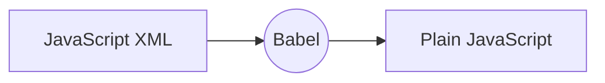

# React

## Reacts to state changes

### Intro

-   A javascript library for building user interfaces
-   By facebook 2011
-   It's Library
-   Angular is Framework
-   React Do Only
    -   it takes care of rendering view and
    -   making sure that the view is in sync with the state.
-   beacause of this react have very few API. When building application, we need to other libraries for:
    -   Routing
    -   calling HTTP servies
    -   etc.

### Component

-   component basically contain `state` and `render()` method.
-   state: Data we want to display when component render
-   render: responsible for describing what UI should look like
-   react element
    -   output of render method
    -   simple plain javascript object that maps to DOM element
    -   it's just plain javascript object that represents that DOM element in memory
-   **Virtual DOM**:
    -   React keeps lightweight representation of the DOM in memory which we referred to **Virtual DOM**.
    -   it's cheap to create.
    -   we don't need to work with DOM API in browsers.
    -   we don't have change and manipulate DOM directly.(e.g. we don't need `document`, `query`, `$`, `queryselector`, `EventListener`)
    -   when component get updates, Instead of chaning whole DOM, react changes only part of DOM which responsible for component.

```js
class Tweet {
	state = {};
	render() {
		// output the react element
	}
}
```

### Setup

-   install nodeJs.
-   then install create-react-app
    ```sh
    npm i -g create-react-app
    ```
-   Id using VS Code, install `Simple React Snippets` extension.

### First React App

-   create app
    ```sh
    create-react-app first-react-app
    ```
-   run application
    ```sh
    npm start
    ```
-   It going to install react and third parties libraries like:
    -   Development server: lightweight
    -   Webpack: for bundling our files
    -   Babel: Modern Javascript Compiler for compiling javascirpt code ([babel repl](https://babeljs.io/repl)).
    -   other tools
-   this will create application with zero configurartion setup
-   for custmized configuration setup use `npm run eject`.
-   open up `App.js` file
    ```js
    render() {
        return (
        // Start JavaScript XML
        <div className="App">
            <header className="App-header">
            
            <p>
                Edit <code>src/App.js</code> and save to reload.
            </p>
            <a
                className="App-link"
                href="https://reactjs.org"
                target="_blank"
                rel="noopener noreferrer"
            >
                Learn React
            </a>
            </header>
        </div>
        // End JavaScript XML
        );
    }
    ```
-   What render function returning (contain inside the return()) is not string nor HTML. It's **JSX(Javascript XML)**.



-   go to

### Resource

-   [React Tutorial for Beginners](https://www.youtube.com/watch?v=Ke90Tje7VS0)
