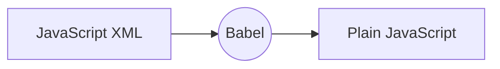

# React - Reacts to state changes

## Index

#### 1. Introduction

-   1.1. Setup
-   1.2. Component
-   1.3. First React App
-   1.4. Props (Passing Data to component)
-   1.5. Fetch data from API
-   1.6. State in react: `useState`
-   1.7. useEffect: built-in hook

#### 2. React Router

#### 3. State Management

-   3.1. Need of State Management
-   3.2. Setup for Context
-   3.3. Usage of context
-   3.4. Update value in context
-   3.5. Pros and Cons

#### 4. Resource

## 1. Intro

-   A javascript library for building user interfaces
-   By facebook 2011
-   It's Library
-   Angular is Framework
-   React Do Only
    -   it takes care of rendering view and
    -   making sure that the view is in sync with the state.
-   beacause of this react have very few API. When building application, we need to other libraries for:
    -   Routing
    -   calling HTTP servies, etc.

### 1.1. Setup

-   install nodeJs.
-   then install create-react-app `npm i -g create-react-app`
-   Id using VS Code, install `Simple React Snippets` extension.

### 1.2. Component

-   Component basically contain `state` and `render()` method.
-   Each component is function which contains JS ans JSX(like html).
-   **state**: Data we want to display when component render
-   **render**: responsible for describing what UI should look like
-   **react element**
    -   output of render method
    -   simple plain javascript object that maps to DOM element
    -   it's just plain javascript object that represents that DOM element in memory
-   **Virtual DOM**:
    -   React keeps lightweight representation of the DOM in memory which we referred to **Virtual DOM**.
    -   it's cheap to create.
    -   we don't need to work with DOM API in browsers.
    -   we don't have change and manipulate DOM directly.(e.g. we don't need `document`, `query`, `$`, `queryselector`, `EventListener`)
    -   when component get updates, Instead of chaning whole DOM, react changes only part of DOM which responsible for component.

```js
class Tweet {
	state = {};
	render() {
		// output the react element
	}
}
```

### 1.3. First React App

-   create app
    ```sh
    create-react-app first-react-app
    ```
-   run application
    ```sh
    npm start
    ```
-   It going to install react and third parties libraries like:
    -   Development server: lightweight
    -   Webpack: for bundling our files
    -   Babel: Modern Javascript Compiler for compiling javascirpt code ([babel repl](https://babeljs.io/repl)).
    -   other tools
-   this will create application with zero configurartion setup
-   for custmized configuration setup use `npm run eject`.
-   open up `App.js` file

```js
render() {
    return (
    // Start JavaScript XML
    <div className="App">
        <header className="App-header">
        
        <p>
            Edit <code>src/App.js</code> and save to reload.
        </p>
        <a
            className="App-link"
            href="https://reactjs.org"
            target="_blank"
            rel="noopener noreferrer"
        >
            Learn React
        </a>
        </header>
    </div>
    // End JavaScript XML
    );
}
```

-   What render function returning (contain inside the return()) is not string nor HTML. It's **JSX(Javascript XML)**.



### 1.4. Props (Passing Data to component)

-   In `App.js`.

```js
import React from 'react';
import Recipe from './Recipe';

function App() {
	return (
		<div className='App'>
			<div>
				{recipes.map((recipeObject) => (
					<Recipe
						title={recipeObject.recipe.label}
						calories={recipeObject.recipe.calories}
						image={recipeObject.recipe.image}
						ingredients={recipeObject.recipe.ingredients}
					/>
				))}
			</div>
		</div>
	);
}

export default App;
```

-   In child elements `Recipe.js`

```js
import React from 'react';

const Recipe = ({ title, calories, image, ingredients }) => {
	return (
		<div>
			<h1>{title}</h1>
			<ol>
				{ingredients.map((ingredient) => (
					<li>{ingredient}</li>
				))}
			</ol>
			<p>{calories}</p>
			
		</div>
	);
};

export default Recipe;
```

### 1.5. Fetch data from API

```js
function App() {
	const APP_ID = '1de4a0dd';
	const APP_KEY = '00e28a18b9433a59eec5eedd973a70ab';
	const [recipes, setRecipes] = useState([]);

	useEffect(() => {
		getRecipes();
	}, [query]);

	// API usage
	const getRecipes = async () => {
		const response = await fetch(
			`https://api.edamam.com/search?q=${query}&app_id=${APP_ID}&app_key=${APP_KEY}`
		);
		const data = await response.json();
		setRecipes(data);
	};
}
```

### 1.6. State in react: useState

```js
import React, { useEffect, useState } from 'react';

function App() {
	// define state
	const [search, setSearch] = useState('');

	// change value of state
	const updateSearch = (e) => {
		setSearch(e.target.value);
	};

	// usage of state
	return (
		<div className='App'>
			<input className='search-bar' type='text' value={search} onChange={updateSearch} />
			<button className='search-button' type='submit'>
				Search
			</button>
		</div>
	);
}

export default App;
```

### 1.7. useEffect: built-in hook

-   By using this Hook, you tell React that your component needs to do something after render. React will remember the function you passed (we'll refer to it as our “effect”), and call it later after performing the DOM updates.

-   When first time our page renders, it going to run this effect. After everytime, something re-render on our page, it also going to run.

```js
useEffect(() => {
	console.log('Effect has been run');
});
```

-   if you want to render only once when first time page render, give empty array as second argument to useEffect.

```js
useEffect(() => {
	console.log('Effect has been run');
}, []);
```

-   if you want to run this effect on some variable change, added that variable into emtpy array. like `counter` in below example.

```js
useEffect(() => {
	console.log('Effect has been run');
}, [counter]);
```

## 2. React Router

```bash
npm install react-router-dom
```

```js
import { BrowserRouter as Router, Switch, Route } from 'react-router-dom';
```

-   **BrowserRouter**: Use to added ability of handling routing in react. you need to wrap code which need routing ability, around `<Router></Router>`
-   **Route**: Renders component based on URL.
-   **Switch**: It kind of stop checking all route as soon as it goes to one and matches the URL. and only render mentions component

```js
import { BrowserRouter as Router, Switch, Route } from 'react-router-dom';

function App() {
	return (
		<Router>
			<div className='App'>
				<Nav />
				<Switch>
					<Route path='/' exact component={Home} />
					<Route path='/about' component={About} />
					<Route path='/shop' exact component={Shop} />
					<Route path='/shop/:id' component={ItemDetail} />
				</Switch>
			</div>
		</Router>
	);
}
```

-   Let's look at how to navigate when you click on button.

```js
import { Link } from 'react-router-dom';

function Nav() {
	return (
		<nav>
			<h3>Logo</h3>
			<ul>
				<Link to='/about'>
					<li>About</li>
				</Link>
				<Link to='/shop'>
					<li>Shop</li>
				</Link>
				<Link to={`/shop/${item.itemId}`}>{item.item.name}</Link>
			</ul>
		</nav>
	);
}
```

## 3. State Management

### 3.1. Need of State Management

```js
<div className='App'>
	<Nav />
	<MovieList />
</div>
```

-   Using prop you can only pass down value through component, but what if you need same data in adjacent component. like movieList data from `MovieList` component need into `Nav` component.
-   this is where **State management** come into picture.

### 3.2. Setup for Context

-   We start with creating context file e.g. `MovieContext.js` which content all movies data

```js
import React, { useState, createContext } from 'react';

export const MovieContext = createContext(); // initialize context

export const MovieProvider = (props) => {
	const [movies, setMovies] = useState([
		{
			name: 'Harry Potter',
			price: '$10',
			id: 234,
		},
		// many movie data
	]);

	return (
		<MovieContext.Provider value={[movies, setMovies]}>{props.children}</MovieContext.Provider>
	);
};
```

-   Whenever we want to use information from `MovieContext.js` we gonna use **MovieContext**.
-   **MovieProvider** just gonna provide th information to the different component.
-   And we need to wrap this `MovieProvider` around all the component that we want to give that ability to access that state.
-   `props.children` render all component that wrap arround `<MovieContext.Provider>` attribute. e.g.

### 3.3. Usage of context

```js
import { MovieProvider } from './MovieContext';
import AddMovie from './AddMovie';

function App() {
	return (
		<MovieProvider>
			<div className='App'>
				<Nav />
				<AddMovie />
				<MovieList />
			</div>
		</MovieProvider>
	);
}
```

-   here as you can see, Navbar, add-movie, and movielisting component need movie data.

### 3.4. Update value in context

-   For now we use centralized data in MovieContext. now how to change and update it.
-   let say we need to add movies in MovieContext.

```js
import React, { useState, useContext } from 'react';
import { MovieContext } from './MovieContext';

const AddMovie = () => {
	const [name, setName] = useState('');
	const [price, setPrice] = useState('');
	const [movies, setMovies] = useContext(MovieContext);

	const updateName = (e) => {
		setName(e.target.value);
	};

	const updatePrice = (e) => {
		setPrice(e.target.value);
	};

	const addMovie = (e) => {
		e.preventDefault();
		// Here we updating value in MovieContext
		setMovies((prevMovies) => [...prevMovies, { name: name, price: price }]);
	};

	return (
		<form onSubmit={addMovie}>
			<input type='text' name='name' value={name} onChange={updateName} />
			<input type='text' name='price' value={price} onChange={updatePrice} />
			<button type='submit'>Add Movie</button>
		</form>
	);
};

export default AddMovie;
```

### 3.5. Pros and Cons:

-   **Pros**: It's really good if we wan to just render out information.
-   **Cons**: If we can to change data in context, problem is every time we update the code in our useContext, all components are going to re-render.

## 9. Resource

-   [React Tutorial for Beginners: With Mosh](https://www.youtube.com/watch?v=Ke90Tje7VS0)
-   [React Tutorial for Beginners Playlist: Dev Ed](https://www.youtube.com/playlist?list=PLDyQo7g0_nsVHmyZZpVJyFn5ojlboVEhE)
